## Advanced Lane Finding Project

### Camera Calibration

#### 1. Briefly state how you computed the camera matrix and distortion coefficients. Provide an example of a distortion corrected calibration image.

I start by preparing "object points", which will be the (x, y, z) coordinates of the chessboard corners in the world. Here I am assuming the chessboard is fixed on the (x, y) plane at z=0, such that the object points are the same for each calibration image.  Thus, `objp` is just a replicated array of coordinates, and `objpoints` will be appended with a copy of it every time I successfully detect all chessboard corners in a test image.  `imgpoints` will be appended with the (x, y) pixel position of each of the corners in the image plane with each successful chessboard detection.  

I then used the output `objpoints` and `imgpoints` to compute the camera calibration and distortion coefficients using the `cv2.calibrateCamera()` function.  

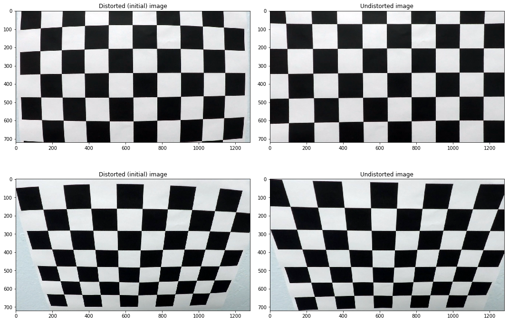

### Pipeline (single images)

#### 1. Provide an example of a distortion-corrected image.

I  applied this distortion correction to the test image using the `cv2.undistort()` function and obtained this result: 

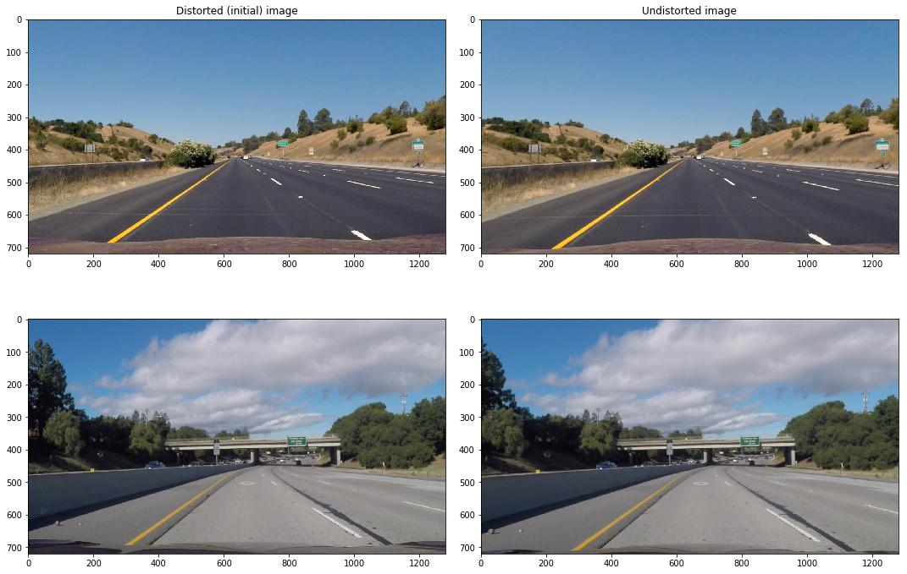

#### 2. Describe how (and identify where in your code) you used color transforms, gradients or other methods to create a thresholded binary image.  Provide an example of a binary image result.

I first tested different color transforms and gradients to see which provided best result:

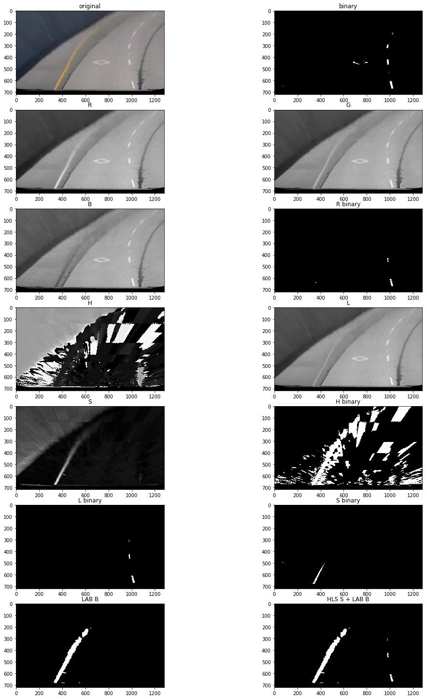 

By combining S channel in HLS colorspace and B channel in LAB colorspace seemed to give best result:

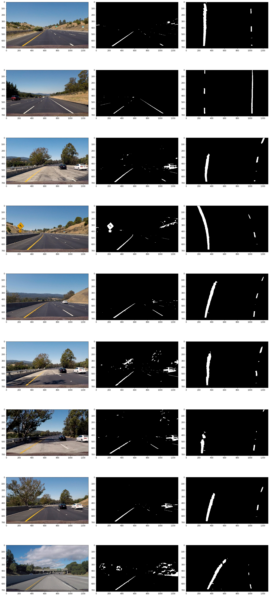

#### 3. Describe how (and identify where in your code) you performed a perspective transform and provide an example of a transformed image.

I marked polycon on test image using relative position to full image (`(.440*imshape[1], .65*imshape[0])`):

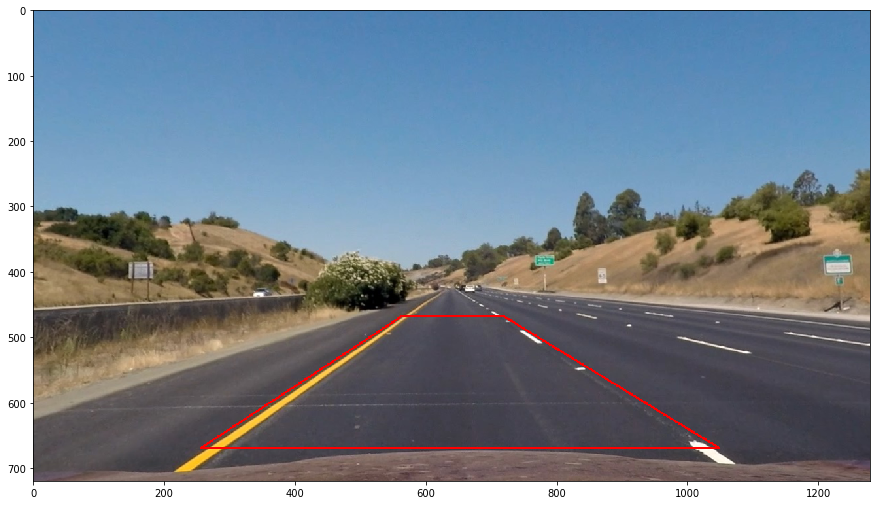

Then I change top right and top left corner x coordinates to be same as bottom right and left corners and calculated perspective transform matrix using `cv2.getPerspectiveTransform(src, dest)`.

Using transform matrix I warped image perspective using `cv2.warpPerspectice` and got following result:

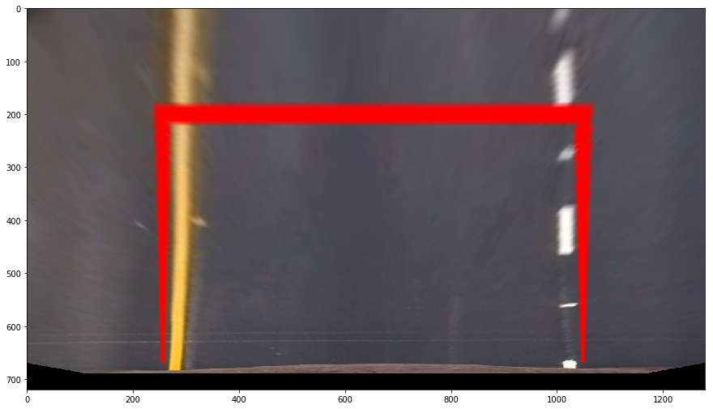

Opposite result can be achieved calculating inverse matrix by switching dest and src in `cv2.getPerspectiveTransform(dest, src):

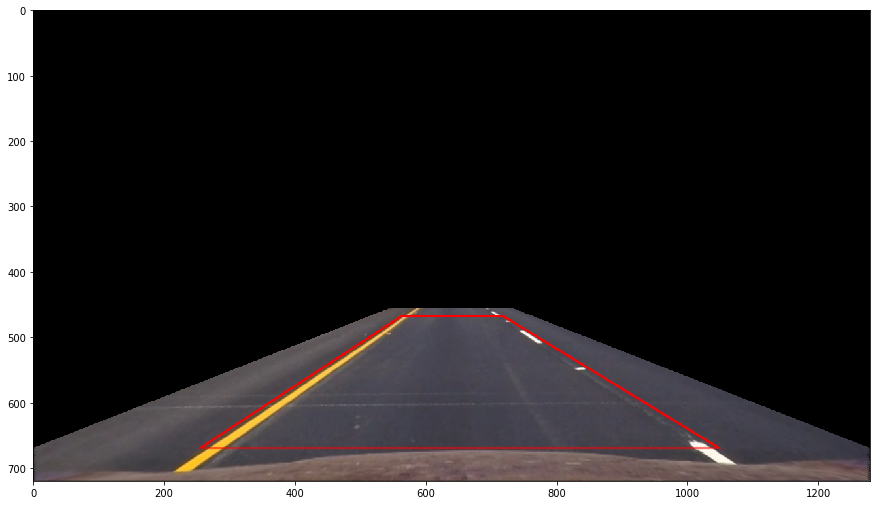

I then tested perspective transform on all test images to validate it is working correctly:

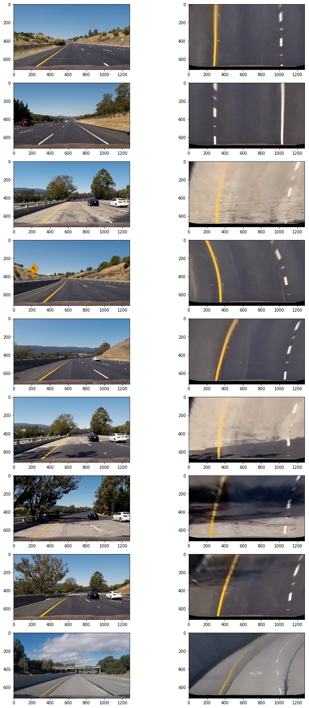

#### 4. Describe how (and identify where in your code) you identified lane-line pixels and fit their positions with a polynomial?

I first took histogram of bottom half of the image to find peak of the left and right halves, which are starting points for left and right lines.

Then 9 windows where used to vertically step through the image and find line pixels. Windows were centered around mean of pixel locations identified in previous window, histogram peak was used for first window.

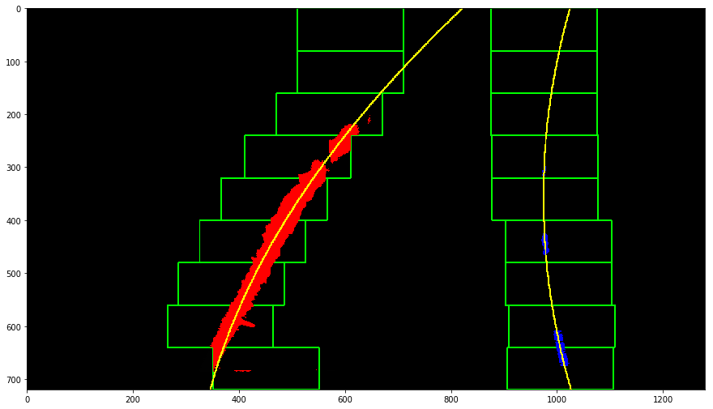

To get better performance, when initial line was found using window method described above, for next frames line pixels were searched only around line found in previous frame, marked green in following image:

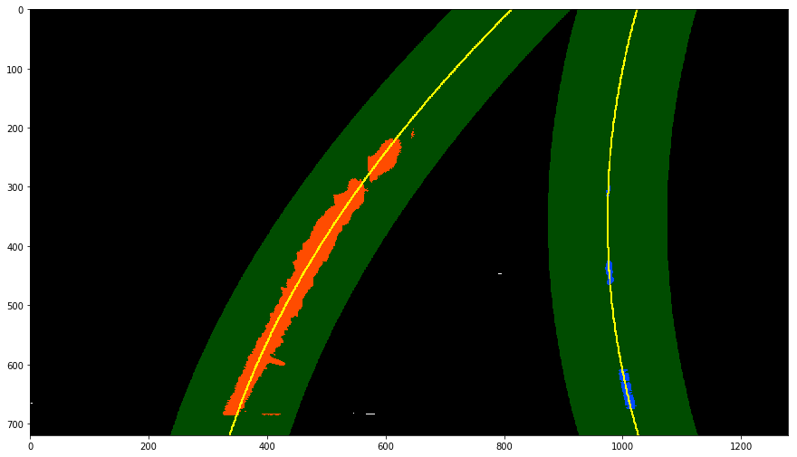

See chapter _"4. Finding lines"_ in notebook for more info.

#### 5. Describe how (and identify where in your code) you calculated the radius of curvature of the lane and the position of the vehicle with respect to center.

Radius of curvature was calculated in chapter _"5. Curvature"_.

Curvature was then calculated for both lines using following formula:

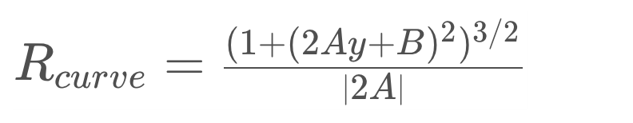

Meters per pixel in y dimension was calculated by dividing estimated lane length with vertical pixel count:

`ym_per_pix = 30/720` 

Vehicle position with respect to lane center was calculate by calculating pixel count between right and left lane lines and dividing by meters per pixel.

Meters per pixel in x dimension was calculated by dividing estimated lane width 3.7m divided by lane pixel count on image.

`xm_per_pix = 3.7/800`l

#### 6. Provide an example image of your result plotted back down onto the road such that the lane area is identified clearly.

Drawing lanes and additional heuristic information was implemented in notebook chapter _"6. Draw lines"_.

This was the result:

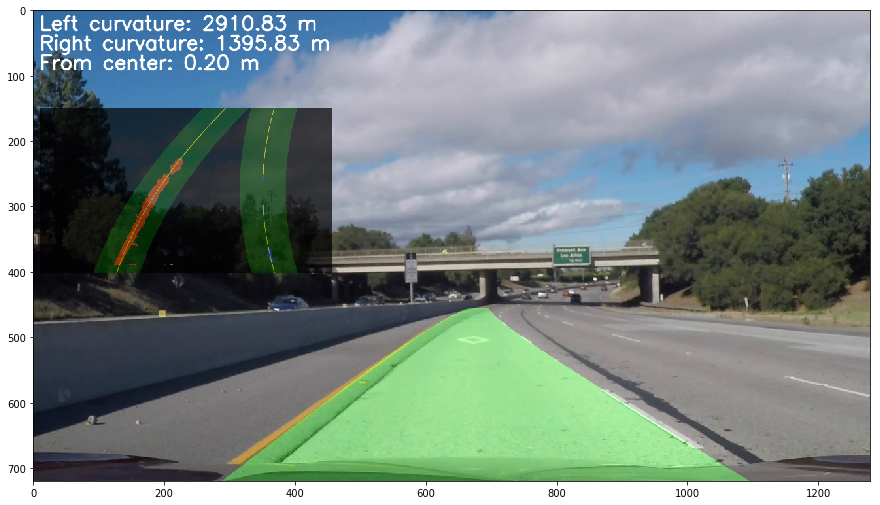

I added additionally small overlay, which help diagnose problems when lane lines are not detected correctly

---

### Pipeline (video)

#### 1. Provide a link to your final video output.  Your pipeline should perform reasonably well on the entire project video (wobbly lines are ok but no catastrophic failures that would cause the car to drive off the road!).

Here's a [link to my video result](./project_video_output.mp4)

---

### Discussion

#### 1. Briefly discuss any problems / issues you faced in your implementation of this project.  Where will your pipeline likely fail?  What could you do to make it more robust?

I also tried with [challenge video](./challenge_video_output.mp4) and [harder challenge video](./harder_challenge_video_output.mp4), but the result were not good. Even smoothing doesn't help as there is still too many problems detecting line pixels. I think improving color and gradient threshold's is needed to improve this. 

Project grew too big to manage in Jupyter notebook, refactoring code into separate python files would help continue improving current solution.